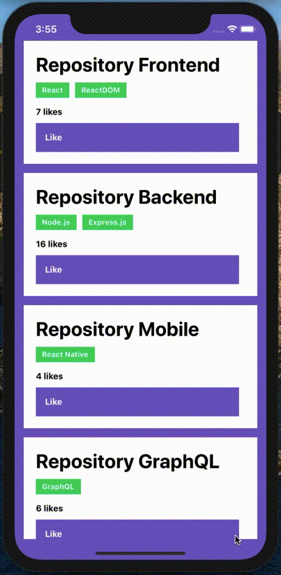

<h3 align="center">
  Challenge 04: React Native Concepts
</h3>

“Success isn't a match result, but the destination of a journey”!</blockquote>

  

  

  <a href="#demo">Demo</a>&nbsp;&nbsp;&nbsp;|&nbsp;&nbsp;&nbsp;
  <a href="#rocket-about-the-challenge">About the challenge</a>&nbsp;&nbsp;&nbsp;|&nbsp;&nbsp;&nbsp;
  <a href="#calendar-deliver">Deliver</a>&nbsp;&nbsp;&nbsp;|&nbsp;&nbsp;&nbsp;
  <a href="#memo-licence">Licence</a>

## Demo

## :rocket: About the challenge

In this challenge, you must create a application to practice what you have learned in React Native!

Now you must continue to develop the application that will store your portfolio repositories, which you have already developed the backend using Node.js, and in the last challenge in ReactJS.

**Pay attention**: If you are emulating on iOS, in your project folder, navigate to the ios folder by running the `cd ios` command and then run `pod install` to install all dependencies for iOS.

### Application Features

Now that you have the template cloned, and ready to continue, you must open the file **src / App.js**, and complete where there's no code with the code to achieve the objectives of each feature.

- **`List the repositories of your API`**: You should be able to create a list of all the repositories that are registered in your API with the fields **title**, **techs** and number of likes following the pattern `$ {repository.likes} likes`, just changing the number to be dynamic.

- **`Like one of the repositories retrieve by the API`**: You must be able to like an item in your API through a button with the text **Like** and you must update the number of likes in the listing on the mobile.

### Tests Specification

In each test, you have a brief description of what your application must do in order for the test suits pass.

For this challenge we have the following tests:

- **`should add a like to the like counter of the repository`**: In order for this test to pass, your application must allow to add a like in one of the listed repositories by clicking on the 'Like' button and that update should be viewed on the screen.

## :memo: Licence

This project is under license from MIT. See the archive [LICENSE](LICENSE) to more details.

---

Made with 💜 by Rocketseat :wave: [Join our community!](https://discordapp.com/invite/gCRAFhc)
